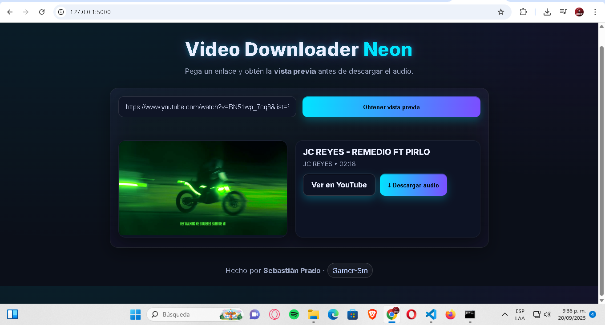

# 🎶 Video Downloader (Flask + yt-dlp)



Aplicación web simple para **descargar audio de videos en línea** (ej. YouTube) usando [Flask](https://flask.palletsprojects.com/) y [yt-dlp](https://github.com/yt-dlp/yt-dlp).  
El objetivo inicial es permitir pegar un enlace de YouTube y obtener el archivo de audio en formato **.m4a** o **.webm** (según disponibilidad).

> ⚠️ En esta versión inicial **no se convierte a MP3** automáticamente. Si el video ofrece M4A se guarda así, de lo contrario se guarda como WebM/Opus.

---

## ✨ Características

- 🎨 Interfaz web sencilla (HTML + JS) con estilo neón.
- 🎵 Descarga del mejor audio disponible (prioriza **M4A/AAC**, fallback a **WebM/Opus**).
- 🌐 Archivos servidos directamente desde Flask vía HTTP.
- 🛡️ Ignora configuraciones externas de `yt-dlp` (evita `.mhtml`).
- 💻 Compatible con Windows (probado en Windows 10 + Python 3.13).

---

## 📦 Requisitos

- [Python 3.9+](https://www.python.org/) (recomendado 3.11 o superior).
- [pip](https://pip.pypa.io/).
- Navegador web moderno (Chrome, Edge, Firefox, etc).

---

## 🚀 Instalación

1. Clonar el repositorio:

   ```bash
   git clone https://github.com/Gamer-Sm/video-downloader.git
   cd video-downloader
   ```

2. Crear y activar entorno virtual:

   **Windows (cmd):**
   ```cmd
   python -m venv .venv
   .venv\Scripts\activate.bat
   ```

   **PowerShell:**
   ```powershell
   python -m venv .venv
   .venv\Scripts\Activate.ps1
   ```

   **Linux/macOS:**
   ```bash
   python3 -m venv .venv
   source .venv/bin/activate
   ```

3. Instalar dependencias:

   ```bash
   pip install -r requirements.txt
   ```

4. Ejecutar la aplicación:

   ```bash
   python app.py
   ```

5. Abrir en el navegador:

   ```
   http://127.0.0.1:5000
   ```

---

## 🗂️ Estructura del proyecto

```
video-downloader/
├── app.py
├── requirements.txt
├── templates/
│   └── index.html
├── downloads/
└── assets/
    └── banner.png
```

---

## 🖥️ Uso

1. Ingresa a `http://127.0.0.1:5000`.
2. Pega la URL de un video de YouTube.
3. Haz clic en **Obtener vista previa** y verifica el thumbnail/título.
4. Pulsa **Descargar audio**; obtendrás un enlace HTTP directo al archivo.

---

## 👨‍🎤 Autor

Hecho por **Sebastián Prado – Gamer-Sm**.

---

## 📜 Licencia

Este proyecto se publica bajo la licencia **MIT**.
